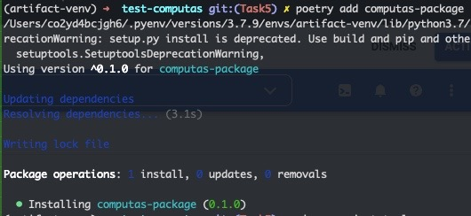

# Deploy a python package on GCP using poetry

## Todo
- [ ] Check if pyenv was the mistake (create a new python env using pyenv and redo the steps that made it work)
- [ ] Again install the global version of poetry 
- [ ] Try to replicate it with the newwest version of poetry

## Prerequsities

1. [Install](https://cloud.google.com/sdk/docs/install-sdk) the gcloud CLI 
2. Enable `Artifact Registry API` (in the [GCP console](https://console.cloud.google.com/))

## Steps to deploy a package on GCP using poetry and test it

1. Create an artifact repo on GCP (either by using gcloud or the [GCP console](https://console.cloud.google.com/))
```
gcloud artifacts repositories create REPOSITORY \
     --repository-format=FORMAT \
     [--location=LOCATION] \
     [--description="DESCRIPTION"] \
     [--async] \
```

Lets first go through the individual arguments and the specific values I set:

- `REPOSITORY`
    - info: arbitrary repository name
    - value: `artifact-repo`
- `FORMAT`
    - info: format of the repository ([view](https://cloud.google.com/artifact-registry/docs/repositories/create-repos#repo-formats)view the list of possible values)
    - value: `python` (since we wish to deploy a python package)
    

- `LOCATION`
    - info: regional or multi-regional location for the repository
    - view a list of supported location by: `gcloud artifacts locations list`
    - value: `europe-west1`
- `DESCRIPTION`
    - info: arbitrary description of the repo (do not include sensitive data)

```
gcloud artifacts repositories create artifact-repo --repository-format=python --location=europe-west1 --description=test repo --async
```

After running the command above you should be able to see the new artifact repository in your Artifact Registry in the GCP console.


View details about the repository (the two urls displayed will be important later)

```
gcloud artifacts print-settings python \
    --project=YOUR_PROJECT_ID \
    --repository=artifact-repo \
    --location=europe-west1
```
An example of a project ID: `computas-project-345810`

2. Create and activate virtual env
```
pyenv virtualenv 3.7.9 artifact-venv
pyenv global artifact-venv
```

3. Install poetry and keyrings for artifact-registry authentication

Here I ran into an issue, since poetry 1.1 versions (1.1.3 is the current release) is not able to handle correctly secrets from Google keyring backend (for reference see this [open issue](https://github.com/GoogleCloudPlatform/artifact-registry-python-tools/issues/17)). So I needed to install a prerelease version `poetry==1.2.0a2`.

```
pip install poetry==1.2.0a2
pip install keyrings.google-artifactregistry-auth
```
Make sure that you are using the newly installed poetry version: `poetry -V`

4. Initialize a poetry project

```
poetry new computas-project
```

5. cd into the newly created project
6. Change poetry config 

```
poetry config repositories.google https://europe-west1-python.pkg.dev/YOUR-PROJECT-ID/artifact-repo/

```
Here `google` is a variable name that is used when publishing the package.
You can view your own url when you run:

```
gcloud artifacts print-settings python \
    --project=YOUR_PROJECT_ID \
    --repository=artifact-repo \
    --location=europe-west1
```

7. Build and publish the package
```
poetry build
poetry publish -r google
```
Here `google` needs to be the same as when you defined it in step 6.
You can now view the package in your artifact repo

### Issues with authentication
Try these:

```
gcloud auth login
gcloud auth application-default login
```

## Test the package in another project
1. Create a new poetry project
```
poetry new test-computas
```
2. cd into the newly created project

3. Add to your `.toml` file the source directory
```
[[tool.poetry.source]]
name = "google"
url = "https://europe-west1-python.pkg.dev/YOUR-PROJECT-ID/artifact-repo/simple/"
```

4. Add the package that you created
```
poetry add computas-package
```

After that, you will see that the package has been added to your dependencies



